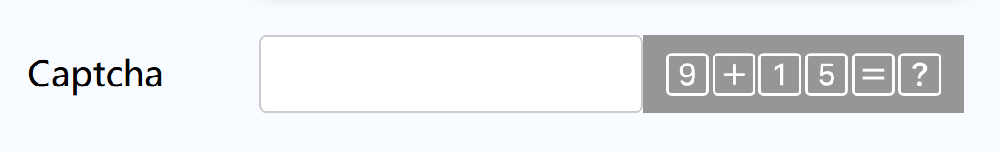

# simp-captcha
纯Javascript的基于SVG的轻量级验证码组件，包含UI和校验。

## 效果：


## 注意：
本组件只适合简单使用场景。校验过程在前端浏览器进行，校验结果明文存在前端浏览器内存中。
主要防止用户无成本频繁提交表单。

## 使用：
```html
<div id="captcha1" class="simp-captcha"></div>

<script src="js/simp-captcha.js"></script>
```

创建一个`div`，验证码即在此展示。`class`固定名`simp-captcha`。如果只有一处使用验证码，则可以忽略`id`属性。

引入`simp-captcha.js`文件，页面初始化时会自动将验证码组件渲染到该`div`中，并生成验证码。

此js文件提供两个方法`simpCaptchaValidate(number, ?id)`, `simpCaptchaNew(?id)`：

1.其中`simpCaptchaValidate`方法用来校验验证码，需将用户填写的验证码number传入该方法，id则表示对应验证码组件div的id属性，可忽略。
2.其中`simpCaptchaNew`方法用来刷新验证码，id表示对应验证码组件div的id属性，可忽略。

## 最后：
欢迎你的参与并感谢你的使用！
